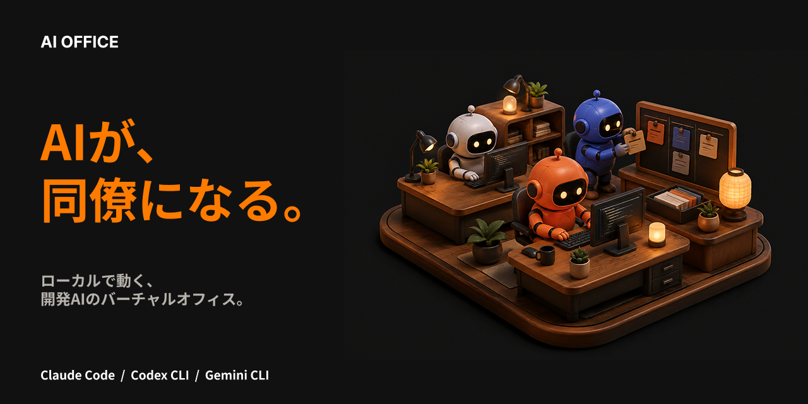
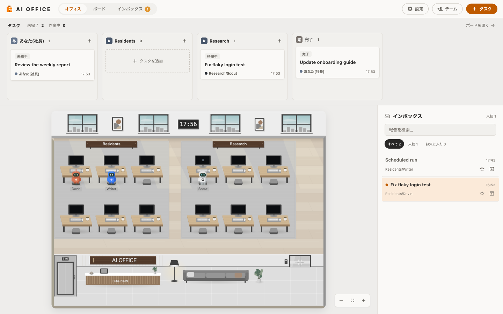
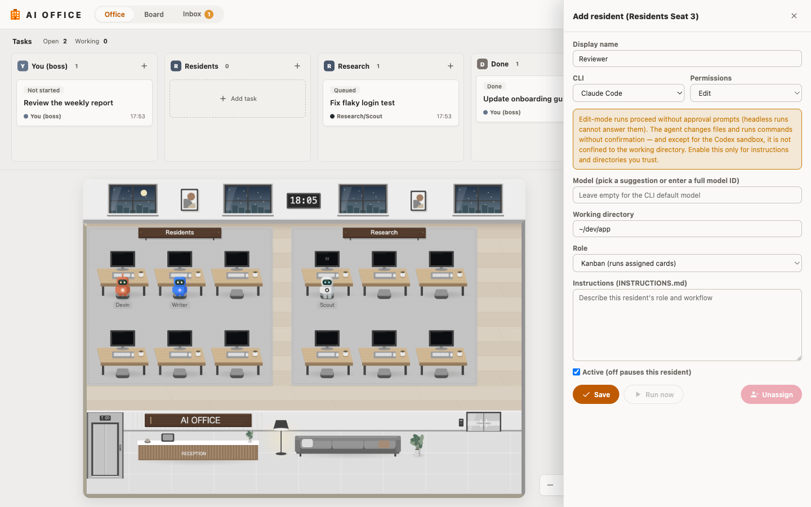
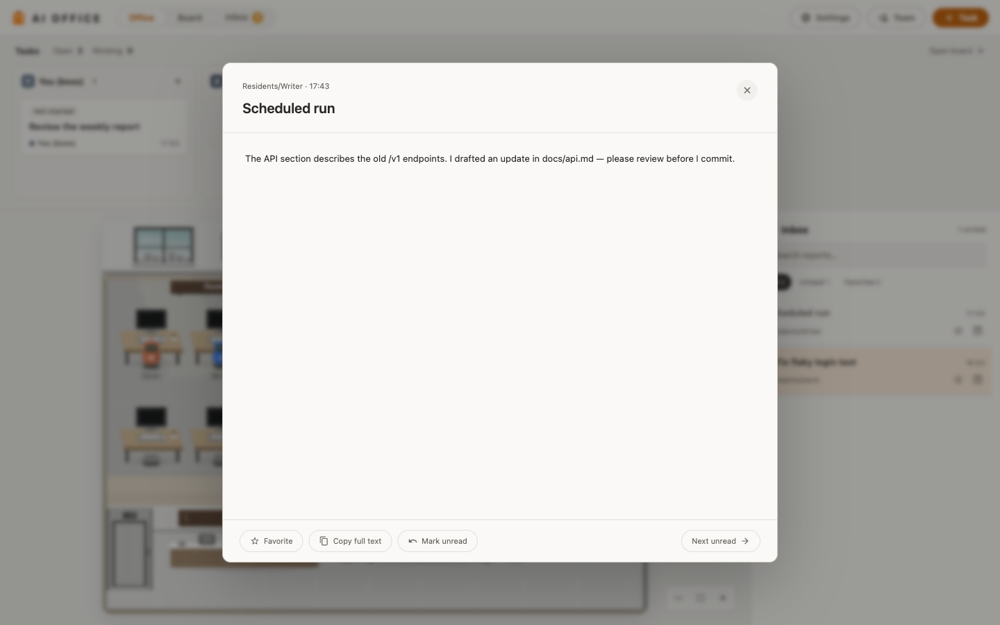
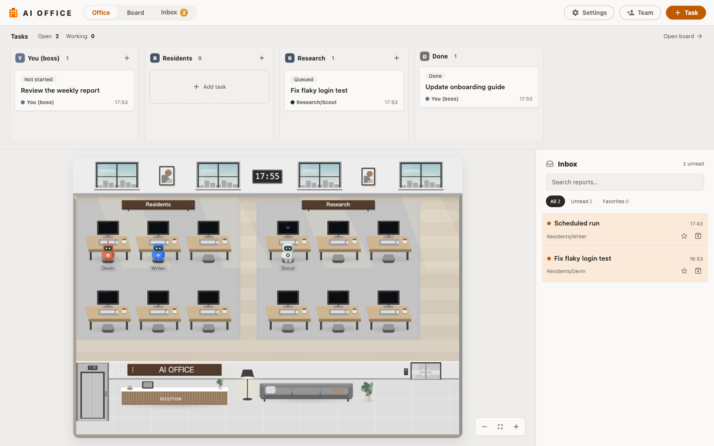

# AI Office

[English README](README.md)



ローカルの AI コーディングエージェントのための、Gather 風バーチャルオフィス。
Claude Code・Codex CLI・Gemini CLI のセッションがミニチュアのロボット社員と
して出社し、常駐AIチームがスケジュールとカンバンボードで働いてインボックス
に報告してくれます。




## できること

- **設定不要でセッションを可視化。** 各 CLI が書き出すトランスクリプトを
  サーバが tail します。ターミナルで Claude Code(または Codex / Gemini)を
  起動すると、ビジターのロボットがエレベーターからロビーに現れ、いま何を
  しているかを吹き出しで表示。サブエージェントはミニアバターとして横に並び、
  ターンが終わるとエレベーターで帰っていきます。
- **常駐AIチームを運用。** 常駐AIはアプリ内で設定する常勤エージェントです。
  それぞれに CLI・作業ディレクトリ・指示書を持たせ、担当カンバン列を順に
  こなすか、曜日時刻・一定間隔のスケジュールで自走させます。実行はヘッド
  レスで行われ、最後のメッセージが報告としてインボックスに届き、人間の判断
  が必要なものには要確認フラグが付きます。
- **カンバンとインボックスで人間がループに入る。** タスクカードを起票する
  と常駐AIが拾い、完了したカードは完了列へ、報告はカードにリンクされます。
  すべてローカルの SQLite ファイル 1 つに保存されます。

## 必要環境

- **macOS**(トランスクリプト検出・プロセスクリーンアップ・データディレク
  トリが macOS 前提です)
- **Node.js ≥ 22.5**(`node:sqlite` を使用。npm スクリプトが
  `--experimental-sqlite` を付与します — 23.4 未満で必要)
- [Claude Code](https://docs.anthropic.com/en/docs/claude-code)・
  [Codex CLI](https://github.com/openai/codex)・
  [Gemini CLI](https://github.com/google-gemini/gemini-cli) のいずれか —
  常駐AIに使う CLI はログイン済みで `PATH` 上にあること

## クイックスタート

```sh
git clone https://github.com/raihara3/ai-office.git
cd ai-office
npm start
# http://localhost:4680 を開く(PORT で変更可)
```

あとは普段どおりエージェントを使うだけです。どこかのリポジトリで Claude
Code を起動すると、そのアバターがロビーに現れます。CLI 側の設定は不要で、
セッションは次の場所から自動検出されます:

| CLI | トランスクリプト |
| --- | --- |
| Claude Code | `~/.claude/projects/**/*.jsonl` |
| Codex CLI | `~/.codex/sessions/YYYY/MM/DD/rollout-*.jsonl` |
| Gemini CLI | `~/.gemini/tmp/<project>/chats/session-*.jsonl` |

### デスクトップアプリ

```sh
npm install       # 初回のみ Electron(devDependency)をインストール
npm run electron  # 同じサーバを内蔵したデスクトップウィンドウ
npm run dist      # electron-builder で未署名の macOS .dmg/.zip をビルド
```

デスクトップアプリと `npm start` はデータディレクトリを共有し、二重実行は
しません(2 つ目のインスタンスは起動中のサーバに接続します)。ビルドは
未署名なので、ダウンロードしたアプリの初回起動は右クリック →「開く」で
Gatekeeper を通過してください。

### テスト

```sh
npm test          # node --test、約150件、ビルド不要
```

## 常駐AIチームのセットアップ

ビジターはターミナルでの作業を映すだけですが、常駐AIは自分で働きます。

1. アプリバーの**チーム**ボタンでチーム(キャンバス上の部屋)を作るか、
   デフォルトチームを使います。
2. チームルームの**空席デスク**をクリックすると常駐員フォームが開きます:



3. CLI・作業ディレクトリ・**役割**を選びます:
   - **カンバン** — 手が空くたびに自分の列の一番上のカードを実行します。
     カードを起票すると 30 秒ほどで拾われます。
   - **定期実行** — ボードを無視してトリガーで指示書を実行します。曜日+
     時刻の固定スロット、または稼働時間帯つきの N 分間隔。**事前チェック
     コマンド**を設定すると各実行をゲートでき、出力が空なら「やることなし」
     としてスキップされます。
4. **指示書**を書きます — 常駐員の恒常的なロールプロンプトです。

モデル欄は候補から選ぶほか任意のフルモデル ID も入力可能で、空欄なら CLI
の既定モデルを使います。

### 権限

- **読み取りのみ**(デフォルト)は調査系に制限されます: Claude は読み取り
  専用ツールの許可リスト、Codex は `--sandbox read-only`、Gemini はプラン
  モード固定。なお Gemini はフォルダ信頼プロンプトをスキップして起動する
  ため、ワークスペース設定(設定済み MCP サーバなど)が有効になります —
  Gemini の常駐AIは中身を信頼できるディレクトリだけに向けてください。
- **編集あり**は**承認プロンプトなしで**ファイル変更・コマンド実行を許可
  します(ヘッドレス実行は承認に答えられないため — Claude は
  `--permission-mode bypassPermissions`、Codex は `--sandbox
  workspace-write`)。Codex のサンドボックスを除き、実行は**作業ディレク
  トリ内に限定されません**。信頼できる指示とディレクトリにのみ有効にして
  ください。選択時にはフォームにも警告が表示されます。

### 報告とボード

実行の最後のメッセージがインボックスに報告として届きます。1 行目が
`LEVEL: review-needed` の報告は要確認としてフラグされ、リンクされたカード
はあなたの列へ移動し、定期実行ならフォローアップカードが自動起票されます。



正常終了した実行はカードを**完了**列に移します(カードと報告のアーカイブは
常に人間の操作 — 完了で消えることはありません)。カードに追記したメモと
過去の報告は次回実行のプロンプトに履歴として引き継がれます。実行は常駐員
ごとに同時 1 件・30 分タイムアウトで、アクティビティビューに緊急停止ボタン
があります。

## 言語

UI・サーバのメッセージ・常駐AIへのプロンプトは**デフォルト英語**です。
設定から **日本語** に切り替えられます。報告は生成された時点の言語で書かれ
ます。



## データとプライバシー

すべてあなたのマシン内で完結します。サーバは `127.0.0.1` のみにバインドし
(Host / Origin チェックあり)、常駐チームの状態 — 設定・指示書・カード・
報告 — はすべて `~/Library/Application Support/ai-office/office.db` に保存
されます。あなたが設定した CLI 実行以外に外部へ送信されるものはありません。

## 仕組み

ウォッチャーが各 CLI のトランスクリプトを観測(現在のツール呼び出し・
プロンプト・サブエージェント起動・ターン完了)にパースし、セッションごと
の状態にマージして Server-Sent Events でブラウザへ配信します。フロント
エンドは高 DPI の Canvas 2D シーン 1 枚+プレーン DOM のパネル構成。コア
はトランスポート非依存で、`index.js` → `core.js` → state/watchers/residents、
唯一のトランスポートが `http.js`、Electron は同じサーバを内蔵します。

- [docs/architecture.md](docs/architecture.md) — ファイル単位の解説と
  データフロー
- [docs/database.md](docs/database.md) — office.db スキーマ(ER 図・規約)

### ステータスの規則

- **作業中** — 直近 90 秒以内に観測があり、ターンが未完了。
- **ブロック中** — ツール呼び出しの結果待ち(典型的には許可待ちのコマンド)。
  吹き出しは ・・・。
- **入力待ち** — 質問や承認のリクエスト中。アバターが 🖐️ を上げ、チャイム
  が鳴ります。
- **休憩** — ターン完了または沈黙。ビジターはエレベーターで退出し、次の
  プロンプトで戻ってきます。
- 3 日間沈黙したセッションはオフィスから退出します。CLI プロセスが消えた
  セッションは受付のクリーンアップ(`ps`/`lsof` ベース)で退勤させられます。

## 制限事項

- macOS 専用です。
- ビジターセッションは可視化のみ: あなたが自分で起動した CLI をオフィスが
  操作することはありません(オフィスが起動する常駐AIの実行のみ例外)。
- Gemini のログパースはベストエフォートです — CLI バージョンによって形式が
  変わります。
- Codex のサブエージェント検出はヒューリスティックです。

## ライセンス

[MIT](LICENSE) © raihara3
