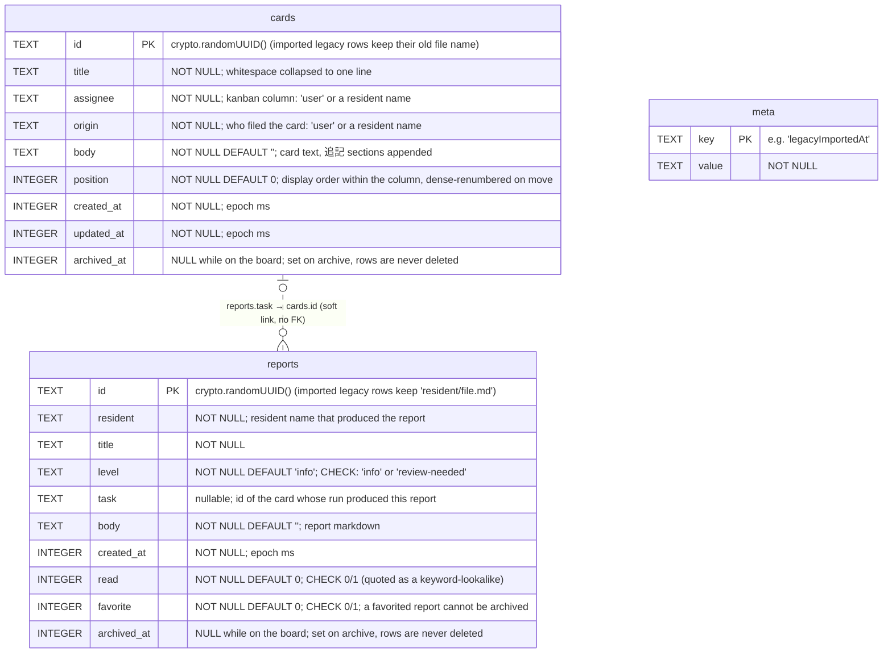

# Database schema (office.db)

The whiteboard reports and kanban cards are persisted in a single SQLite
database at `~/Library/Application Support/ai-office/office.db`, opened by
`server/residents/database.js` (built-in `node:sqlite`, WAL mode, schema
versioned with `PRAGMA user_version` — currently **1**).

## ER diagram

## Relationships

- **cards 0..1 — 0..n reports**: `reports.task` carries the id of the card whose
  run produced the report, so the card detail view can pull its reports in.
  It is a *soft* link — no foreign key — because the card may be archived (or
  imported rows may reference ids that no longer resolve), and rows are never
  deleted so referential cleanup is unnecessary.
- **meta** is a standalone key-value table for one-shot flags; today it only
  holds `legacyImportedAt`, the marker that prevents the legacy Markdown
  import from running twice.

## Indexes

| Index | Definition | Serves |
|---|---|---|
| `reports_active` | `(created_at DESC) WHERE archived_at IS NULL` | newest-first report listing / badge counts |
| `cards_column` | `(assignee, position) WHERE archived_at IS NULL` | per-column card listing, top-card lookup |

Both are partial indexes over active rows only, matching every query's
`archived_at IS NULL` filter.

## Conventions

- **Archive, never delete**: taking an item off the board sets `archived_at`
  (epoch ms). Listings and counts filter to `archived_at IS NULL` and cap at
  100 rows; archived rows stay queryable for analysis.
- **Pragmas**: `journal_mode = WAL`, `busy_timeout = 5000`,
  `synchronous = NORMAL`. The `office.db-wal` / `office.db-shm` sidecar files
  are normal WAL companions — never delete or copy them independently.
- **Migrations**: `database.js` applies each pending migration in its own
  transaction and bumps `user_version`; a database whose `user_version` is
  newer than the app understands is refused at startup.
