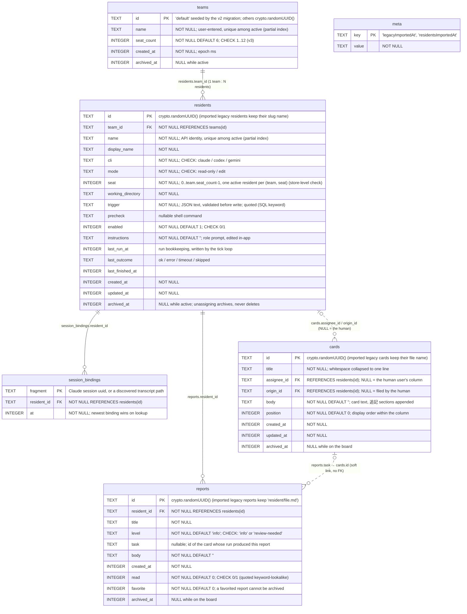

# Database schema (office.db)

Teams, residents, session bindings, whiteboard reports and kanban cards are
persisted in a single SQLite database at
`~/Library/Application Support/ai-office/office.db`, opened by
`server/residents/database.js` (built-in `node:sqlite`, WAL mode, schema
versioned with `PRAGMA user_version` — currently **3**).

## ER diagram

## Identity and relationships

- **Names vs ids**: the HTTP API and store method signatures speak resident
  *names* (`'user'` for the human); every foreign key underneath uses the
  *id*. Writes resolve a name to an **active** resident's id; listings join
  the name back **including archived residents**, so an unassigned
  resident's leftover cards and historical reports keep naming their owner.
- **Id conventions**: new rows get `crypto.randomUUID()`. Rows imported from
  the pre-v2 file stores keep their legacy identifier as the id (resident
  slug / card file name / `resident/file.md`), which is what let the v2
  migration copy name strings verbatim into the FK columns.
- **Ghost residents**: a name referenced by cards/reports but configured
  nowhere gets an archived placeholder row (id = name) so foreign keys hold
  and the display name survives (`resident-import.js` / `ensureResidentId`).
- **The human is not a resident**: `cards.assignee_id IS NULL` is the user's
  kanban column, `origin_id IS NULL` marks human-filed cards.
- **reports.task → cards.id stays a soft link** (no FK): the card may be
  long archived and imported ids may not resolve; rows are never deleted so
  referential cleanup is unnecessary.
- **Name reuse**: archiving frees the name (uniqueness is a partial index on
  active rows). A successor with the same name is a fresh id; the
  predecessor's leftover cards display under the name but are never worked.

## Indexes

| Index | Definition | Serves |
|---|---|---|
| `teams_active_name` | `UNIQUE (name) WHERE archived_at IS NULL` | active team name uniqueness |
| `residents_active_name` | `UNIQUE (name) WHERE archived_at IS NULL` | name-based API identity |
| `residents_active_team` | `(team_id) WHERE archived_at IS NULL` | team joins |
| `session_bindings_at` | `(at DESC)` | newest-first binding lookup |
| `cards_column` | `(assignee_id, position) WHERE archived_at IS NULL` | per-column listing, top-card lookup |
| `reports_active` | `(created_at DESC) WHERE archived_at IS NULL` | newest-first report listing |

## Conventions

- **Archive, never delete**: removal of any kind sets `archived_at`;
  listings and counts filter to active rows and cap at 100. **One sanctioned
  exception**: `session_bindings` prunes past 200 rows with DELETE — bindings
  are an operational cache (transcripts expire after ~3 days), not user data.
- **Foreign keys are enforced** (`node:sqlite` has `PRAGMA foreign_keys = ON`
  by default). `openDatabase` turns them OFF only while migrations run — the
  v2 rebuild briefly holds name strings in id columns until the resident
  importer fills the parent rows — and back ON afterwards.
- **Quoted identifiers**: `"trigger"` (SQL keyword) and `"read"` are always
  quoted in DDL and statements.
- **Pragmas**: `journal_mode = WAL`, `busy_timeout = 5000`,
  `synchronous = NORMAL`. The `office.db-wal` / `office.db-shm` sidecar files
  are normal WAL companions — never delete or copy them independently.
- **Team management**: creating a team takes a name and seat count (both
  editable later); shrinking below an occupied seat, deleting a team that
  still has active residents, and deleting the last team are all refused.
  The v3 migration renamed the seeded team 'office' → '常駐チーム' (only if
  untouched) so the canvas label carried over seamlessly.
- **Migrations**: `database.js` applies each pending migration in its own
  transaction and bumps `user_version`; a database whose `user_version` is
  newer than the app understands is refused at startup. One-time data
  imports (`resident-import.js`, `legacy-import.js`) run right after the
  migrations, guarded by `meta` markers, and delete their source files only
  after committing.
